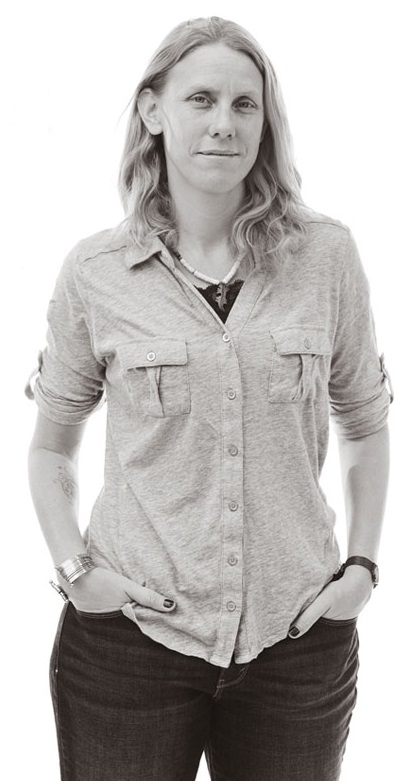
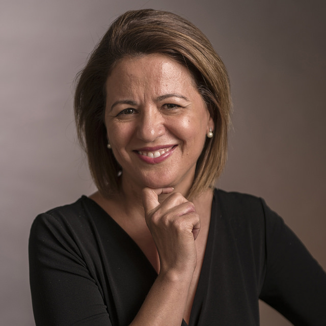

<table>
<tbody>

<tr>
<td>Dr. Robin Donatello</td>
<td><strong>Speciality: </strong> Biostatistics    
    <strong>Teaches: </strong> 
        MATH 105: Statistics, MATH 130: Introduction to R, MATH 315, MATH 385, MATH 456, MATH 485, MATH 615    
    <strong>Contact: </strong> rdonatello@csuchico.edu  
    <a href="www.norcalbiostat.com">www.norcalbiostat.com</a>   </td>
<td>Dr. Donatello is an Assistant Professor in the Department of Mathematics and Statistics. She is also the Data Science Initative Coordinator.</td>
</tr>

<tr>
<td>Dr. Rick Hubbard</td>
<td><strong>Speciality: </strong> Design Thinking    
    <strong>Teaches: </strong>BSIS 610    
    <strong>Contact: </strong> rphubbard@csuchico.edu   
    </td>
<td> Dr. Hubbard is a Lecturer in the Department of Business Informations Systems. 
</td>
</tr>

<tr>
<td>Dr. Essia Hamouda</td>
<td><strong>Speciality: </strong> Networking    
    <strong>Teaches: </strong>CSCI 385, CSCI 485    
    <strong>Contact: </strong> ehamouda@csuchico.edu 
</td>
<td> Dr. Hamouda is an Assistant Professor in the Department of Computer Science. 
</td>
</tr>

</tbody>
</table>
